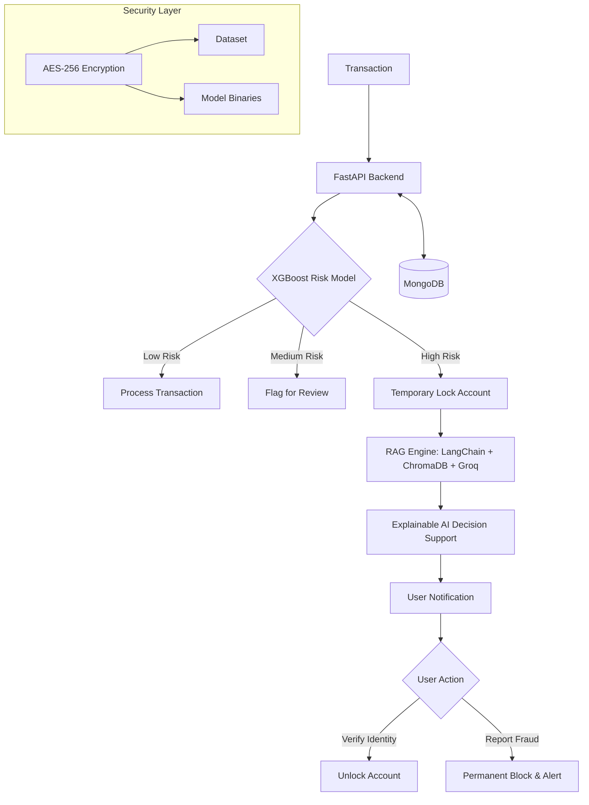

# SentinelFraud: Real-Time Risk Detection & Explainable AI

SentinelFraud is an advanced financial fraud detection system that combines high-performance machine learning with Generative AI (RAG) to provide not just detection, but **decision support**. By integrating XGBoost for risk scoring and Groq-powered LLMs for explanation, the system ensures transparency in fraud mitigation.

## 🎯 New Project Direction
Following jury feedback, the system has pivoted from a simple detection tool to a **Comprehensive Risk Management Framework**. It now emphasizes:
- **Transparency**: Using RAG to explain *why* a transaction was flagged.
- **Prevention**: Implementing an automatic "Temporary Lock" for high-risk events.
- **Security**: AES-256 encryption for sensitive datasets and models.
- **Recovery**: A two-way verification flow allowing users to recover accounts or report fraud.

## 🏗 Architecture



## 🛠 Tech Stack

| Component | Technology | Purpose |
| :--- | :--- | :--- |
| **Risk Engine** | XGBoost | High-precision fraud probability scoring |
| **Explainability** | Groq + LangChain + ChromaDB | RAG-based explanation for flagged transactions |
| **Backend** | FastAPI | High-performance async API |
| **Frontend** | React + Vite + Tailwind | Real-time monitoring & user verification portal |
| **Database** | MongoDB | Scalable document storage for logs and users |
| **Security** | PyCryptodome (AES-256) | End-to-end encryption of models and data |
| **Infrastructure** | Docker + Docker Compose | Containerized deployment |

## ✨ Key Features

- **⚡ Real-Time Risk Scoring**: XGBoost model evaluates transactions in milliseconds.
- **🤖 RAG-Powered Explanations**: Instead of a "Fraud" label, the system provides a natural language explanation (e.g., *"Transaction flagged due to unusual location shift and high amount compared to user history"*).
- **🔒 Automated Temporary Lock**: Instant account freezing when risk exceeds a critical threshold to prevent capital flight.
- **🛡️ AES-256 Model Security**: Protects the proprietary ML model and sensitive PII data from unauthorized access.
- **🔄 Recovery Workflow**: A secure portal where users can verify their identity to unlock accounts or report fraud to the bank.

## 🏃 How to Run

### 1. Backend & DB
```bash
# Run from the PROJECT ROOT directory, not from inside backend/
pip install -r backend/requirements.txt
cp .env.example .env  # Fill in MONGO_URI, GROQ_API_KEY, ENCRYPTION_KEY
uvicorn backend.main:app --reload
```

### 2. ML Pipeline
```bash
cd ml
pip install -r requirements.txt
python train.py # Trains and encrypts the model into /models
```

### 3. RAG Engine
```bash
# Add .txt or .md fraud policy documents to rag/documents/ (optional)
# Run from the PROJECT ROOT:
pip install sentence-transformers chromadb langchain-community
python rag/ingest.py  # Populates ChromaDB with fraud policy documents
```

### 4. Frontend
```bash
cd frontend
npm install
npm run dev
```

## 👥 Team Roles
- **ML Engineer**: Risk model development, AES encryption, and model optimization.
- **Backend & Security**: FastAPI orchestration, MongoDB integration, and Lock/Unlock logic.
- **Frontend & AI**: React Dashboard and RAG integration for explainable AI.

## 🎬 Demo Flow

1. **Normal Flow**: User makes a transaction $\rightarrow$ XGBoost (Low Risk) $\rightarrow$ Transaction processed.
2. **Fraud Flow**: User makes a transaction $\rightarrow$ XGBoost (High Risk) $\rightarrow$ **Account Locked**.
3. **Explanation**: The system queries ChromaDB and Groq $\rightarrow$ Displays: *"Your account was locked because the transaction from [City, Country] is inconsistent with your spending pattern."*
4. **Resolution**: User logs into the portal $\rightarrow$ Uploads ID / Verifies $\rightarrow$ **Account Unlocked**.
