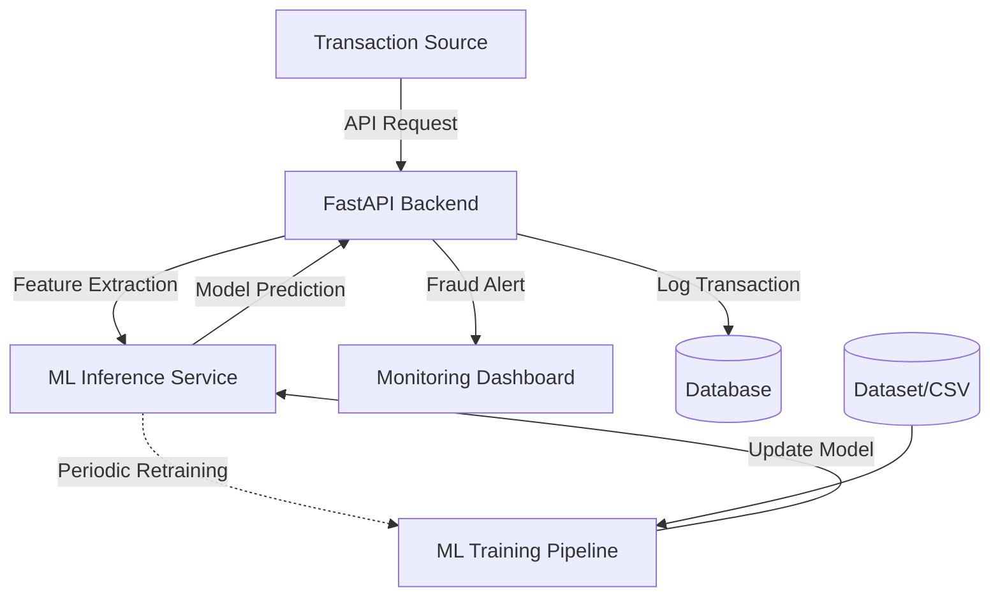

# FC-05: Real-Time Financial Fraud Detection

A real-time fraud detection system designed for high-throughput financial transactions, utilizing machine learning to identify suspicious patterns and alert systems instantly.

## 🚀 Project Overview
This project implements an end-to-end pipeline for detecting fraudulent transactions. It combines a high-performance FastAPI backend, a React-based monitoring dashboard, and a Scikit-Learn/XGBoost machine learning model.

## 🏗 Architecture



## 🛠 Tech Stack

| Layer | Technology |
| :--- | :--- |
| **Frontend** | React, Vite, Tailwind CSS, Recharts |
| **Backend** | FastAPI, Pydantic, Uvicorn |
| **ML** | Python, Scikit-Learn, XGBoost, Pandas, NumPy |
| **Deployment** | Docker, Docker Compose |
| **Data** | CSV (Initial), SQLite/PostgreSQL (Target) |

## 🏃 How to Run

### Prerequisites
- Python 3.9+
- Node.js 18+
- Docker & Docker Compose

### 1. Backend Setup
```bash
cd backend
python -m venv venv
source venv/bin/activate  # Windows: venv\Scripts\activate
pip install -r requirements.txt
cp .env.example .env
uvicorn main:app --reload
```

### 2. Frontend Setup
```bash
cd frontend
npm install
npm run dev
```

### 3. ML Model Setup
```bash
cd ml
pip install -r requirements.txt
python train.py
```

## 👥 Team
- **Frontend Developer**: [Name]
- **Backend Developer**: [Name]
- **ML Engineer**: [Name]

## 🎬 Demo Flow
1. **Transaction Submission**: A transaction is sent to the `/predict` endpoint.
2. **Real-time Analysis**: The backend calls the ML model to get a fraud probability score.
3. **Alerting**: If the score exceeds the threshold, the transaction is flagged as "Fraudulent".
4. **Visualization**: The React dashboard updates in real-time to show the new transaction and overall fraud metrics.
